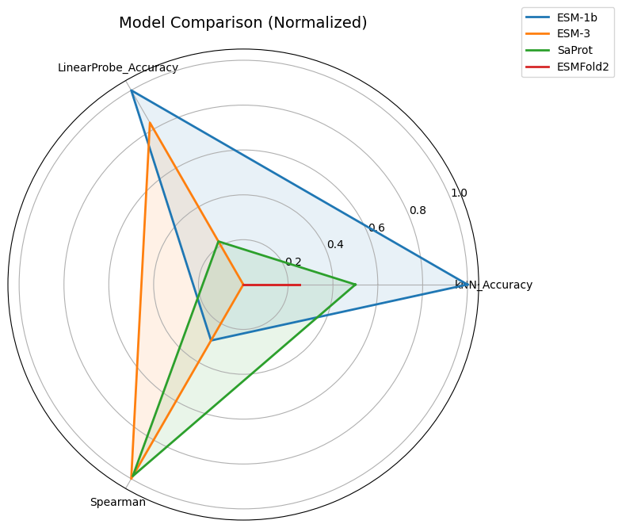
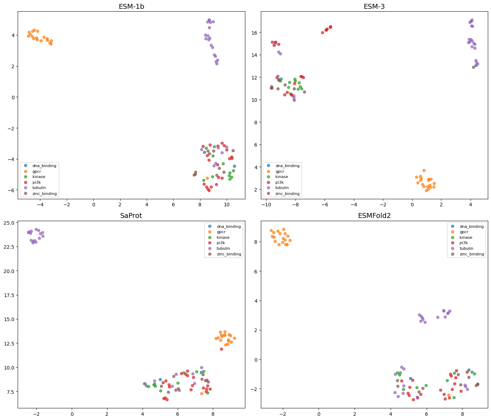
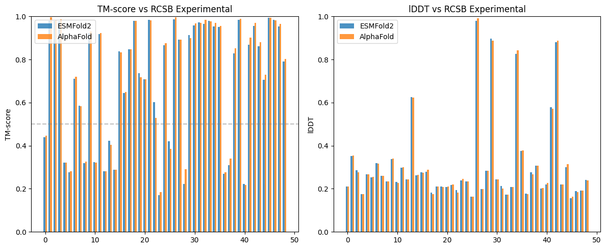
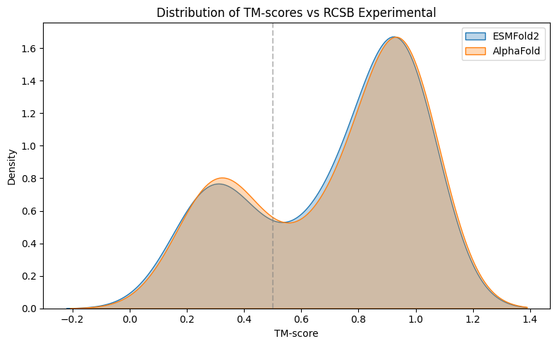

# Protein Foundation Model Benchmarking

Systematic evaluation of protein language models (PLMs) and DNA foundation models on functional classification of 85 high-quality human proteins across 6 functional groups.

## Models Benchmarked

### Benchmark 1: Sequence & DNA Models (`PLM_Benchmarking.ipynb`)

| Model | Input Type | Parameters | Source |
|-------|-----------|------------|--------|
| ESM-1b | Protein sequence | 650M | Meta AI |
| ESM-3 | Protein sequence | 1.4B | EvolutionaryScale |
| SaProt | Structure-aware (seq + 3Di) | 650M | Westlake University |
| AlphaGenome | DNA sequence | — | Google DeepMind |
| Evo2 | DNA sequence | 7B | Arc Institute |

### Benchmark 2: ESMFold2 Evaluation (`PLM_Benchmarking_ESMFold2.ipynb`)

| Model | Input Type | Parameters | Source |
|-------|-----------|------------|--------|
| ESM-1b | Protein sequence | 650M | Meta AI |
| ESM-3 | Protein sequence | 1.4B | EvolutionaryScale |
| SaProt | Structure-aware (seq + 3Di) | 650M | Westlake University |
| ESMFold2 / ESMC-600M | Protein sequence | 600M | EvolutionaryScale / CZ Biohub |

## Dataset

- **85 proteins** with high-confidence AlphaFold structures (pLDDT >= 0.80)
- **6 functional groups**: tubulin (24), PI3K (20), GPCR (18), kinase (11), zinc-binding (10), DNA-binding (2)
- Source: UniProt human proteome, curated via keyword + GO annotation
- Protein list: [`benchmark_proteins_85.csv`](benchmark_proteins_85.csv)

## Evaluation Metrics

| Metric | What It Measures |
|--------|-----------------|
| **Spearman correlation** | Alignment between embedding similarity and functional group membership |
| **Linear Probe (3-fold CV)** | Classification accuracy using logistic regression on embeddings |
| **kNN (k=5, 3-fold CV)** | Classification accuracy using k-nearest neighbors in cosine space |
| **Structural Spearman** | Correlation between embedding similarity and 3D structural similarity (RCSB) |
| **TM-score** | Global structural similarity between predicted and experimental structures |
| **lDDT** | Local distance difference test — per-residue structural accuracy |

---

## Results — Benchmark 1: Sequence & DNA Models

### Classification Performance


### UMAP Embedding Visualization


### Model Representation Similarity


### Per-Model Protein Similarity

| ESM-1b | ESM-3 |
|--------|-------|
|  |  |

| SaProt | AlphaGenome |
|--------|-------------|
|  |  |

| Evo2 | |
|------|--|
|  | |

### Sequence Identity Control


### Statistical Significance

- **Friedman test** (non-parametric repeated measures) across all models
- **Wilcoxon signed-rank test** between top-performing model pairs

### Key Findings

- Sequence-based PLMs (ESM-1b, ESM-3) achieve the strongest functional classification
- Structure-aware SaProt provides competitive Spearman correlation but lower linear probe accuracy
- DNA-based models (AlphaGenome, Evo2) capture distinct representation geometry — low correlation with protein-level models
- Low inter-group sequence identity confirms the benchmark tests genuine representation quality, not sequence similarity leakage

---

## Results — Benchmark 2: ESMFold2 Evaluation

This benchmark evaluates ESMFold2 (built on the ESMC-600M backbone) in two capacities: (1) embedding quality for functional classification, and (2) structure prediction quality compared against AlphaFold and RCSB experimental ground truth.

### Classification Performance

| Model | kNN Accuracy | Linear Probe Accuracy | Spearman |
|-------|-------------|----------------------|----------|
| ESM-1b | 0.706 | **0.824** | 0.324 |
| ESM-3 | 0.659 | 0.788 | **0.358** |
| SaProt | 0.682 | 0.659 | 0.358 |
| ESMFold2 | 0.671 | 0.612 | 0.310 |



### UMAP Embedding Visualization



### Structure Prediction Quality (vs RCSB Experimental)

ESMFold2 predicted structures were compared against RCSB experimental ground truth for 49 proteins that had experimental structures available.

| Model | Mean TM-score | Median TM-score | Mean lDDT | Median lDDT | N |
|-------|--------------|----------------|-----------|------------|---|
| ESMFold2 | 0.716 | 0.849 | 0.308 | 0.241 | 49 |
| AlphaFold | 0.720 | 0.852 | 0.309 | 0.244 | 49 |

#### Per-Class TM-score Breakdown

| Functional Group | ESMFold2 | AlphaFold |
|-----------------|----------|-----------|
| zinc_binding | 0.882 | 0.892 |
| pi3k | 0.812 | 0.818 |
| kinase | 0.727 | 0.719 |
| dna_binding | 0.709 | 0.722 |
| tubulin | 0.705 | 0.719 |
| gpcr | 0.583 | 0.584 |



#### TM-score Distribution



### Statistical Significance

- **Wilcoxon signed-rank test** (paired, n=49): statistic = 338.0, p = 5.68e-03
- AlphaFold performs statistically significantly better, though the absolute difference is minimal (0.005 TM-score)

### Key Findings

- ESM-1b remains the strongest model for functional classification (highest linear probe accuracy)
- ESMFold2 embeddings (via ESMC-600M) underperform ESM-1b and ESM-3 on classification tasks
- ESMFold2 structure predictions are effectively equivalent to AlphaFold on this dataset (TM-score difference < 0.005)
- Both predictors achieve high structural accuracy (median TM-score ~0.85), with GPCRs being the hardest class

---

## Repository Structure

```
├── PLM_Benchmarking.ipynb           # Benchmark 1: ESM-1b, ESM-3, SaProt, AlphaGenome, Evo2
├── PLM_Benchmarking_ESMFold2.ipynb  # Benchmark 2: ESMFold2 evaluation + structure prediction
├── Results_Showcase.ipynb           # Results display notebook (no GPU needed)
├── benchmark_proteins_85.csv        # The 85-protein dataset (accessions & groups)
├── autophagy_proteins.csv           # Source protein list
├── figures/                         # Generated plots
└── results/                         # CSV tables with metrics
```

## How to Reproduce

1. Open `PLM_Benchmarking.ipynb` in Google Colab (GPU runtime required)
2. Mount Google Drive and ensure source data is at `protein_benchmark_v2/`
3. Run all cells — results save to `protein_benchmark_v2_RESULTS/`

For the ESMFold2 benchmark:
1. Open `PLM_Benchmarking_ESMFold2.ipynb` in Google Colab (GPU runtime required)
2. The notebook handles dataset curation, embedding generation, structure prediction, and evaluation end-to-end
