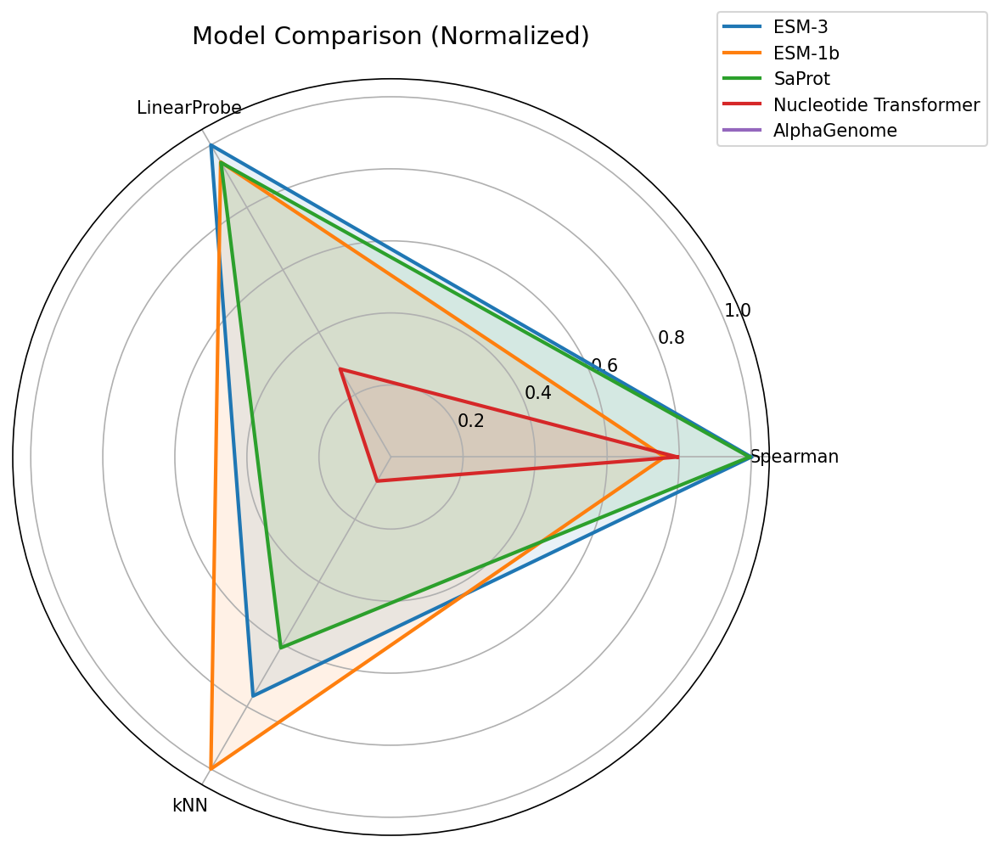
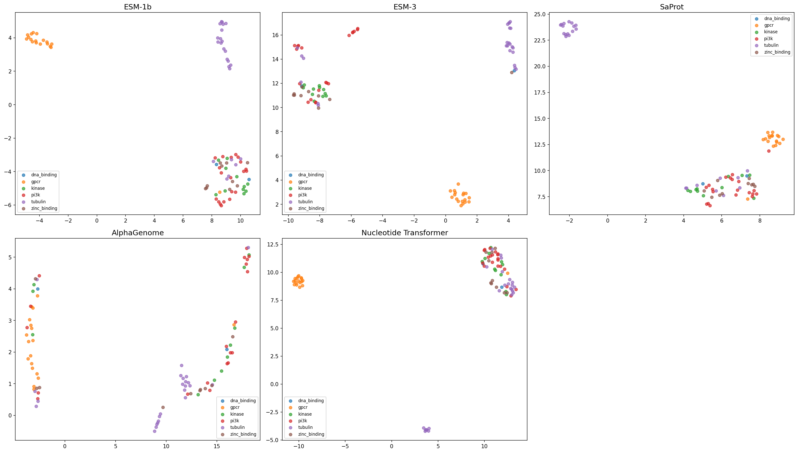
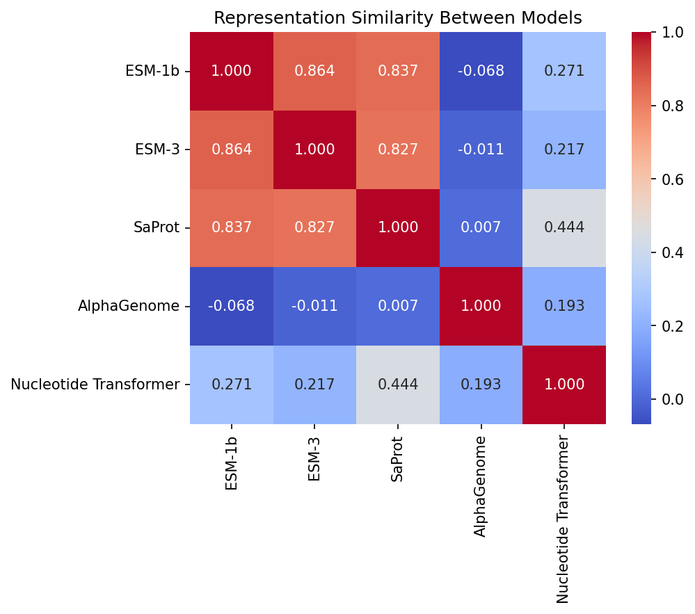
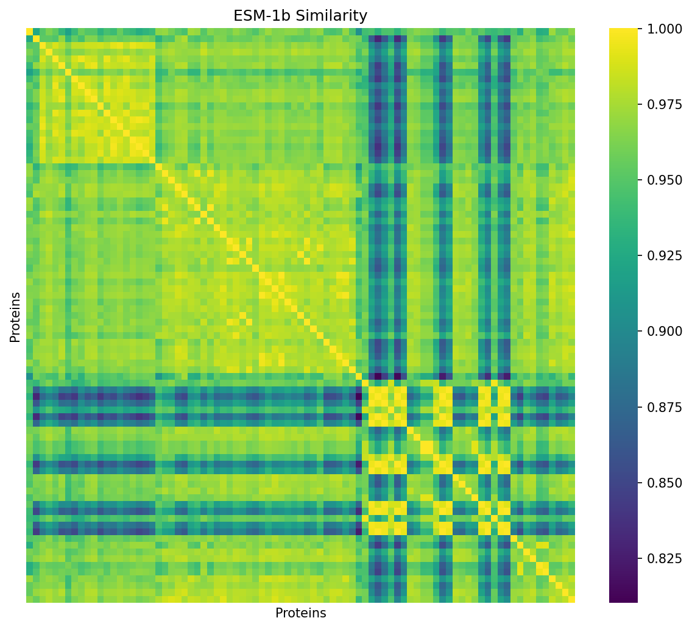
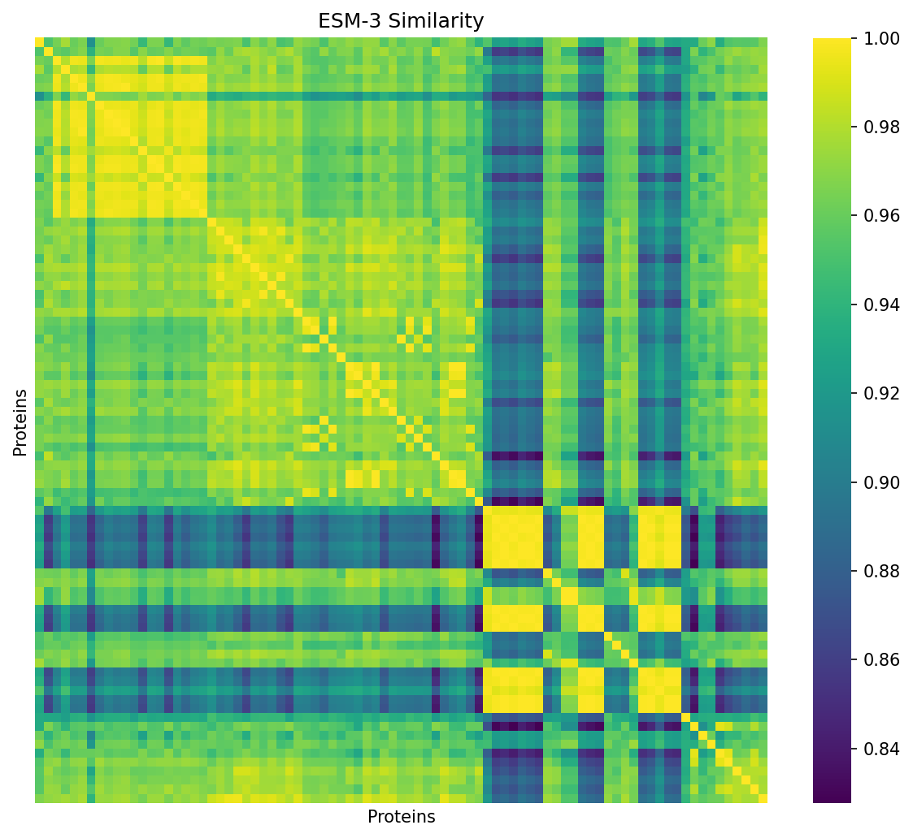
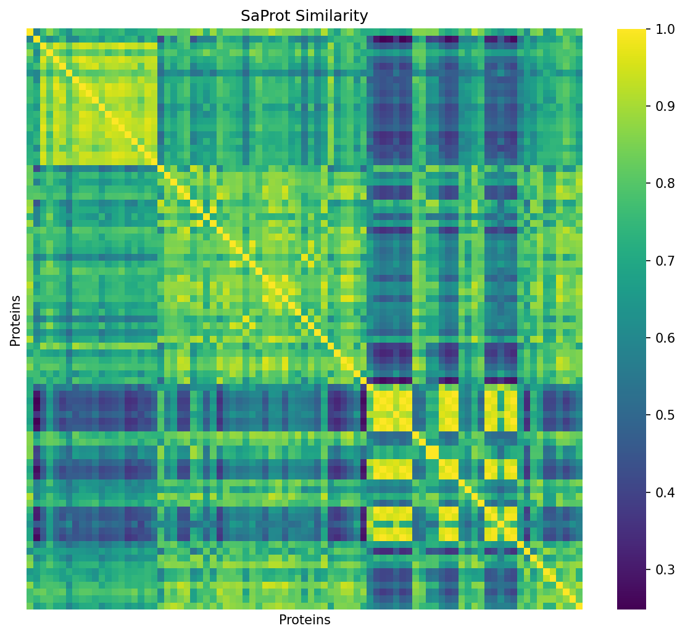
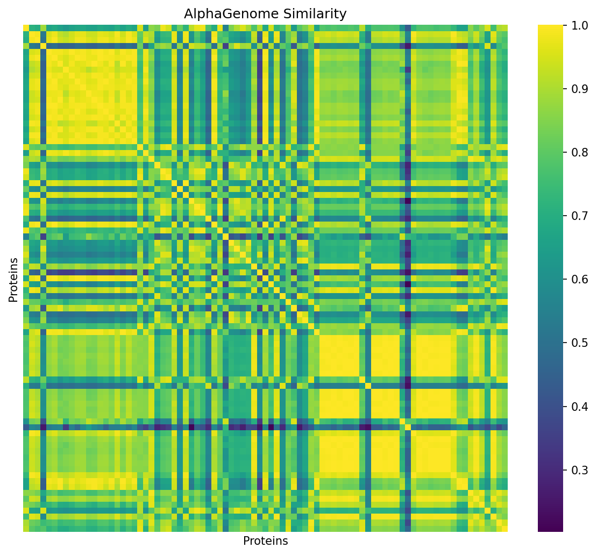
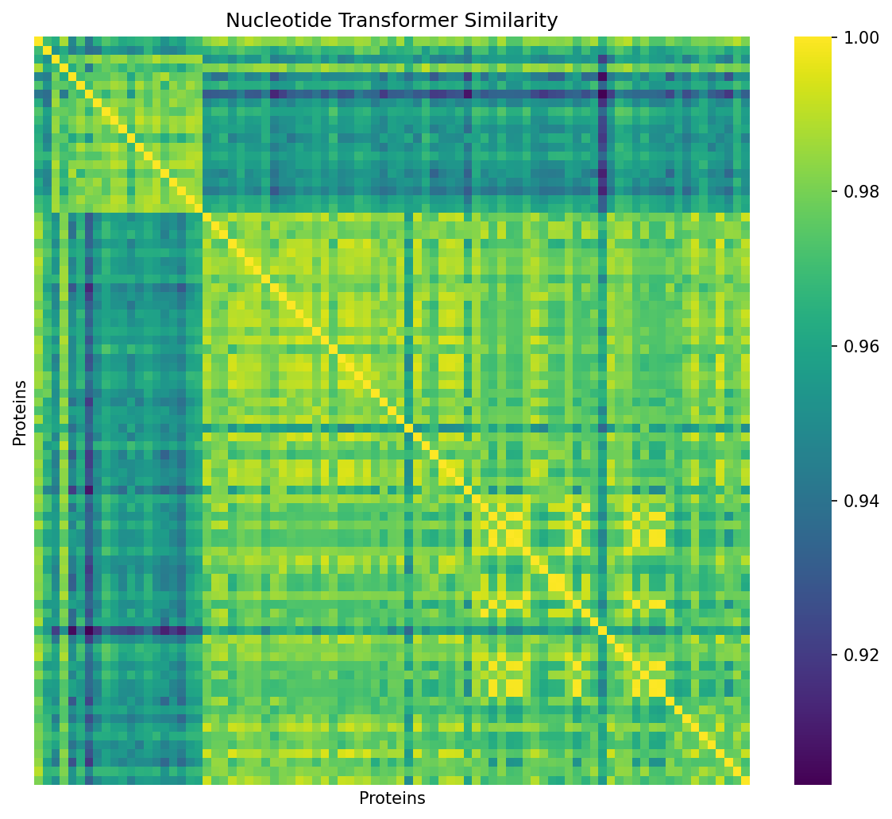
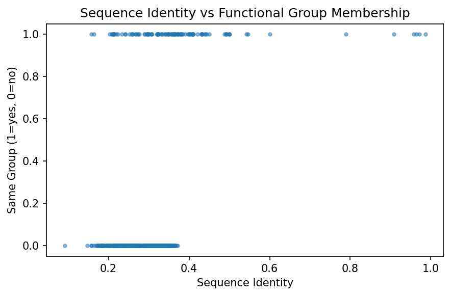

# Protein Foundation Model Benchmarking

Systematic evaluation of protein language models (PLMs) and DNA foundation models on functional classification of 85 high-quality human proteins across 6 functional groups.

## Models Benchmarked

| Model | Input Type | Parameters | Source |
|-------|-----------|------------|--------|
| ESM-1b | Protein sequence | 650M | Meta AI |
| ESM-3 | Protein sequence | 1.4B | EvolutionaryScale |
| SaProt | Structure-aware (seq + 3Di) | 650M | Westlake University |
| AlphaGenome | DNA sequence | — | Google DeepMind |
| Evo2 | DNA sequence | 7B | Arc Institute |

## Dataset

- **85 proteins** with high-confidence AlphaFold structures (pLDDT >= 0.80)
- **6 functional groups**: tubulin (24), PI3K (20), GPCR (18), kinase (11), zinc-binding (10), DNA-binding (2)
- Source: UniProt human proteome, curated via keyword + GO annotation

## Evaluation Metrics

| Metric | What It Measures |
|--------|-----------------|
| **Spearman correlation** | Alignment between embedding similarity and functional group membership |
| **Linear Probe (3-fold CV)** | Classification accuracy using logistic regression on embeddings |
| **kNN (k=5, 3-fold CV)** | Classification accuracy using k-nearest neighbors in cosine space |
| **Structural Spearman** | Correlation between embedding similarity and 3D structural similarity (RCSB) |

## Results

### Classification Performance



### UMAP Embedding Visualization



### Model Representation Similarity



### Per-Model Protein Similarity

| ESM-1b | ESM-3 |
|--------|-------|
|  |  |

| SaProt | AlphaGenome |
|--------|-------------|
|  |  |

| Evo2 | |
|------|--|
|  | |

### Sequence Identity Control



## Statistical Significance

- **Friedman test** (non-parametric repeated measures) across all models
- **Wilcoxon signed-rank test** between top-performing model pairs

## Repository Structure

```
├── PLM_Benchmarking.ipynb  # Full pipeline (run on Colab with GPU)
├── Results_Showcase.ipynb                       # Results display notebook (no GPU needed)
├── figures/                                     # Generated plots
├── results/                                     # CSV tables with metrics
└── autophagy_proteins.xlsx                  # Source protein list
```

## Key Findings

- Sequence-based PLMs (ESM-1b, ESM-3) achieve the strongest functional classification
- Structure-aware SaProt provides competitive Spearman correlation but lower linear probe accuracy
- DNA-based models (AlphaGenome, Evo2) capture distinct representation geometry — low correlation with protein-level models
- Low inter-group sequence identity confirms the benchmark tests genuine representation quality, not sequence similarity leakage
